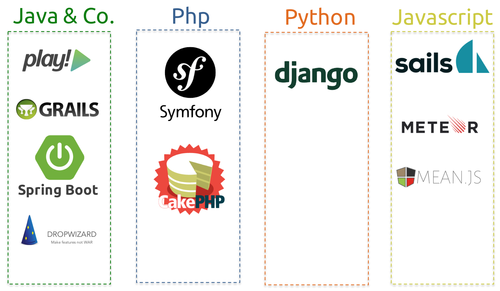

# Principe

Play! est conçu pour accroitre la productivité des développeurs d’applications s’exécutant sur la JVM (Java Virtual Machine).

Il est fondamentalement basé sur des principes Web, donc dans le respect du protocole HTTP.

Il se veut simple, flexible et puissant.

Il fait partie de la famille des frameworks dits `productifs` qui sont issues de la philosophie promue par Ruby On Rails (RoR).

Principes prônés par RoR :
* Convention plutôt que configuration
* Regroupement des bonnes pratiques
* Environnement intégré

