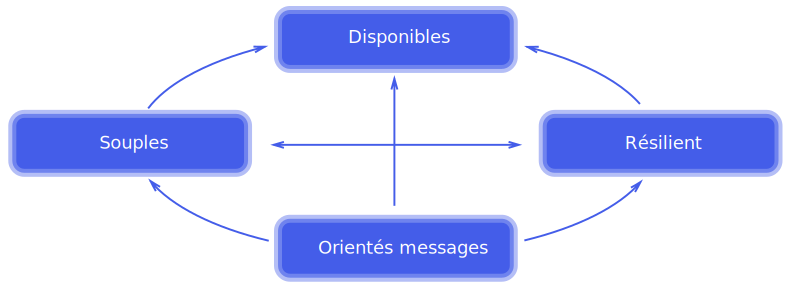

# Reactive Manifesto

* Consultable à l’adresse : http://www.reactivemanifesto.org/fr

* Un système réactif est :

  * `disponible`. Le système répond rapidement en toutes circonstances et permet de détecter très tôt des erreurs.

  * `souple`. Le système reste disponible quelque soit la charge de travail.
  
  * `résilient` Le système reste disponible en cas d’erreur (réplication de fonctionnalités, le cloisonnement des composants, …)

  * `orienté message`. Les composants communiquent par le biais de messages asynchrones (couplage faible et meilleurs gestion des cas d’erreurs).

