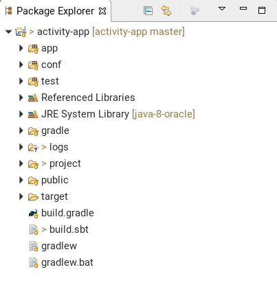

# TP #1 - Premiers pas

## Prérequis

### Java 8

Play! requiert Java 8.

Pour vérifier la version de Java

```
java --version
```

Pour installer un JDK, se rendre sur le site d'Oracle : http://www.oracle.com/technetwork/java/javase/downloads/index.html.

### SBT

Installer SBT : https://www.scala-sbt.org/download.html

Veuillez vous assurer que vous avez accès à la commande :

```
sbt
```

## Créer un projet

* Se positionner dans un répertoire de travail.

* Exécuter la commande suivante :

```
sbt new playframework/play-java-seed.g8
```

* Saisir le nom `focused-mind` et l'organisation `dev`.

Exemple de log :

```
This template generates a Play Java project 

name [play-java-seed]: focused-mind
organization [com.example]: dev
scala_version [2.12.4]: 
play_version [2.6.15]: 
sbt_version [1.0.4]: 

Template applied in ./focused-mind

```

Anatomie d'une application Play!

```
/app                        --> code de l'application                
  /controllers              --> contrôleurs
    HomeController.java
  /views                    --> vues
    index.scala.html
    main.scala.html
/conf                       --> configuration application
  application.conf
  logback.xml
  routes
/project                   --> configuration projet   
  build.properties
  plugins.sbt
/public                    --> ressources statiques
  /images
    favicon.png
  /javascripts
    main.js
  /stylesheets
    main.css
/test                      --> tests
  HomeControllerTest.java
.gitignore
build.sbt                  --> construction du projet avec SBT
build.gradle               --> constructuion du projet avec Gradle
```

* Démarrer l'application en mode développement :

```
cd focused-mind
sbt run
```

par défaut, le port 9000 est utilisé.

Pour démarrer l'application sur un port différent : `sbt 'run 8000'`

* Visualiser la page affichée.


* Arrêter l'application.

## IDE

### IntelliJ IDEA

* Installer ou vérifier l'installation des plugins suivants :
    * `Scala Plugin`
    * `Play! Framework`
    * `SBT`

* Importer le projet comme un projet SBT classique : `File > Open...` puis sélectionner le fichier `build.sbt` puis `Open as Project`.

### Eclipse

Le projet `sbt-eclipse` (https://github.com/sbt/sbteclipse) permet de générer les fichiers de configuration d'Eclipse.


* Compléter le fichier `project/plugins.sbt` comme suit :


```java
addSbtPlugin("com.typesafe.sbteclipse" % "sbteclipse-plugin" % "5.2.4")
```

* Compléter le fichier `build.sbt` :

```java

// forcer la compilation avant la génération des fichiers Eclipse
EclipseKeys.preTasks := Seq(compile in Compile, compile in Test)


EclipseKeys.projectFlavor := EclipseProjectFlavor.Java           // Java project. Don't expect Scala IDE
EclipseKeys.createSrc := EclipseCreateSrc.ValueSet(EclipseCreateSrc.ManagedClasses, EclipseCreateSrc.ManagedResources)  // Use .class files instead of generated .scala files for views and routes
```

* Lancer la commande :

```
sbt eclipse
```

Les fichiers/dossiers suivants sont générés :

```
/settings
.project
.classpath
```

* Importer le projet dans Eclipse via le menu `File > Import ...`


Exemple d'affichage d'un projet dans Eclipse.




