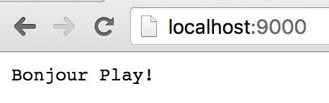
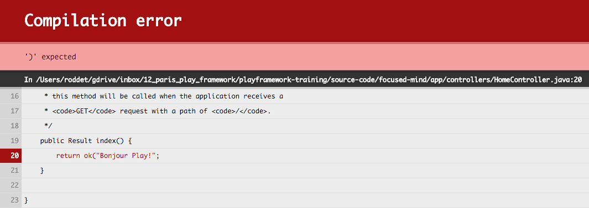
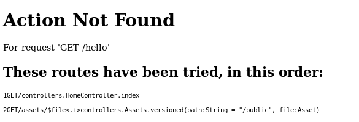
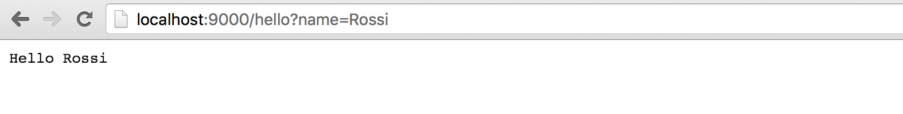
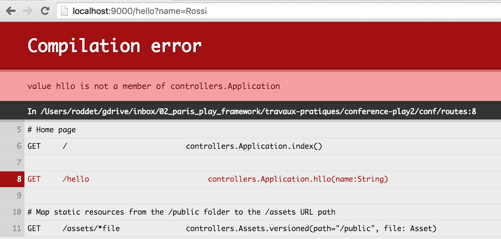
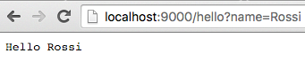
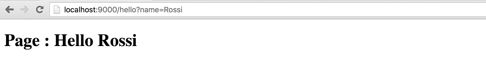

# TP #2 - SBT

## La console intéractive

* Depuis la racine du projet, lancer la commande _sbt_.

La console interactive se lance :

```
focused-mind>  sbt
[info] Loading project definition from /Users/roddet/gdrive/inbox/02_paris_play_framework/travaux-pratiques/focused-mind/project
[info] Set current project to focused-mind (in build file:/Users/roddet/gdrive/inbox/02_paris_play_framework/travaux-pratiques/focused-mind/)
[focused-mind] $
```

> Pour Intellij, vous avez un onglet `sbt shell` qui permet de lancer la console intéractive.

* Demander la compilation du projet

```
[focused-mind] $ compile
[success] Total time: 0 s, completed Jan 18, 2016 11:57:43 AM
```

* Démarrer l'application en mode développement

```
[focused-mind] $ run

--- (Running the application, auto-reloading is enabled) ---

[info] p.c.s.NettyServer - Listening for HTTP on /0:0:0:0:0:0:0:0:9000

(Server started, use Ctrl+D to stop and go back to the console...)

[info] - play.api.Play - Application started (Dev)
```

* Arrêter l'application avec _CTRL + D_.

* Exécuter les tests de l'application

```
[focused-mind] $ test
[info] Compiling 2 Java sources to /Users/roddet/gdrive/inbox/02_paris_play_framework/travaux-pratiques/focused-mind/target/scala-2.11/test-classes...
[info] /Users/roddet/gdrive/inbox/02_paris_play_framework/travaux-pratiques/focused-mind/test/ApplicationTest.java: /Users/roddet/gdrive/inbox/02_paris_play_framework/travaux-pratiques/_focused-mind/test/ApplicationTest.java uses or overrides a deprecated API.
[info] /Users/roddet/gdrive/inbox/02_paris_play_framework/travaux-pratiques/focused-mind/test/ApplicationTest.java: Recompile with -Xlint:deprecation for details.
[info] - application - Creating Pool for datasource 'default'
[info] - application - Shutting down connection pool.
[error] Test IntegrationTest.test failed: null, took 2.908 sec
[error] Failed: Total 3, Failed 1, Errors 0, Passed 2
[error] Failed tests:
[error] 	IntegrationTest
[error] (test:test) sbt.TestsFailedException: Tests unsuccessful
[error] Total time: 5 s, completed Jan 18, 2016 12:04:05 PM
```

Lancer la console scala

```
[focused-mind] $ console
[info] Starting scala interpreter...
[info]
Welcome to Scala version 2.11.6 (Java HotSpot(TM) 64-Bit Server VM, Java 1.8.0_45).
Type in expressions to have them evaluated.
Type :help for more information.

scala>
```

Evaluer du code

```
scala> views.html.index()
res1: play.twirl.api.HtmlFormat.Appendable =


<!DOCTYPE html>
<html lang="en">
    <head>

        <title>Welcome to Play</title>
        <link rel="stylesheet" media="screen" href="/assets/stylesheets/main.css">
        <link rel="shortcut icon" type="image/png" href="/assets/images/favicon.png">
    </head>
    <body>


  <h1>Welcome to Play!</h1>


        <script src="/assets/javascripts/main.js" type="text/javascript"></script>
    </body>
</html>
```

Sortir de la console.

```
scala> :quit
```

Exécuter l'application :

```
[focused-mind] $ ~run
```

## Erreurs de compilation

Modifier le fichier _app/controllers/HomeController.java_ comme suit :

```java
public class HomeController extends Controller {

    public Result index() {
        return ok("Bonjour Play!");
    }

}
```

Rafraichisser la page du navigateur.



Introduire une erreur de compilation Java dans le fichier _app/controllers/HomeController.java_.

Rafraichisser la page du navigateur.



Corriger l'erreur de compilation.

Rafraichisser la page. Il ne doit plus avoir d'erreur.

## Compilation des routes

Depuis le navigateur, accéder à la page _http://localhost:9000/hello_.



Ajouter une méthode au fichier _app/controllers/HomeController.java_ :

```java
public Result hello(String name) {
  return ok("Hello " + name);
}
```

Ajouter la ligne suivante au fichier `conf/routes` :

```
GET     /hello                           controllers.HomeController.hello(name:String)
``` 

Accéder à la page _http://localhost:9000/hello_


Accéder à la page _http://localhost:9000/hello?name=Rossi_



Introduire une erreur dans le fichier _conf/routes_ puis accéder à la page _http://localhost:9000/hello?name=Rossi_.



Corriger l'erreur introduite.



## Créer une vue

* Créer un fichier _app/views/hello.scala.html_ avec le contenu suivant :

```html
@(name:String)
<!doctype html>
<html>
  <head>
    <meta charset="UTF-8">
    <title>Page Hello</title>
  </head>
  <body>
    <h1>Page : Hello @name</h1>
  </body>
</html>
```

> Intellij : clic droit sur le répertoire `views` puis `New > Play 2 Template`.

* Modifier la méthode _app.controllers.HomeController.hello(String)_ comme suit :

```java
public Result hello(String name) {
  return ok(views.html.hello.render(name));
}
```

* Accéder à la page `http://localhost:9000/hello?name=Rossi`.


