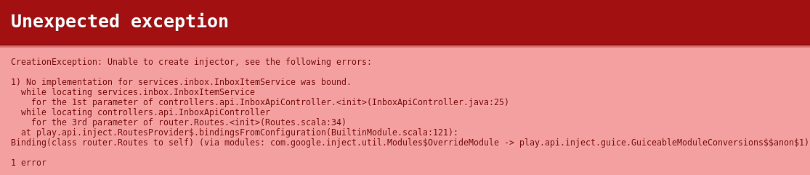

# TP #4 - Injection de dépendances

## @Inject

* Modifier la classe `InboxApiController` comme suit :

```java
public class InboxApiController extends Controller {

    private InboxItemService inboxItemService;

    @Inject
    public InboxApiController(InboxItemService inboxItemService) {
        this.inboxItemService = inboxItemService;
    }
    
    // ...
    
}
```

* Tester l'application.



* Avez-vous compris le problème ?

## @ImplementedBy

* Placer l'annotation `@ImplementedBy` sur l'interface `InboxItemService` :

```java
@ImplementedBy(InboxItemServiceHashMap.class)
public interface InboxItemService {
    // ...
}
```

* Vérifier que l'application fonctionne à nouveau.

## Module Guice

* Désactiver l'utilisation de l'annotation `@ImplementedBy`.

```java
// @ImplementedBy(InboxItemServiceHashMap.class)
public interface InboxItemService {
    // ...
}
```

* Créer une classe `app/Module.java` héritant de `AbstractModule` :

```java

/**
 * Cette classe représente un module Guice.
 * Ce module est instancié au démarrage de l'application Play!.
 */
public class Module extends AbstractModule {


    @Override
    protected void configure() {

        // Choix de l'implémentation de l'interface InboxItemService
        bind(InboxItemService.class).to(InboxItemServiceHashMap.class);

    }
}
```

* Vérifier que l'application fonctionne.