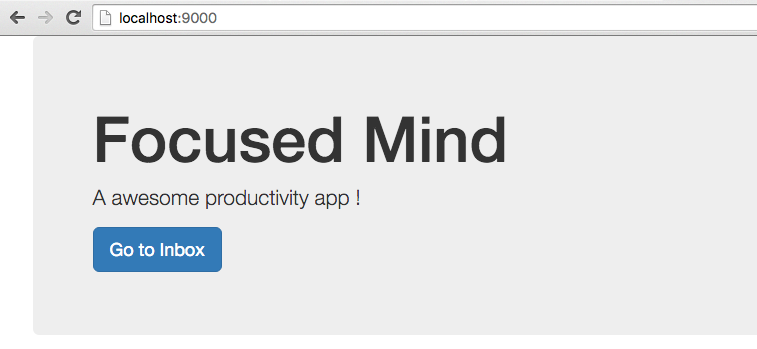
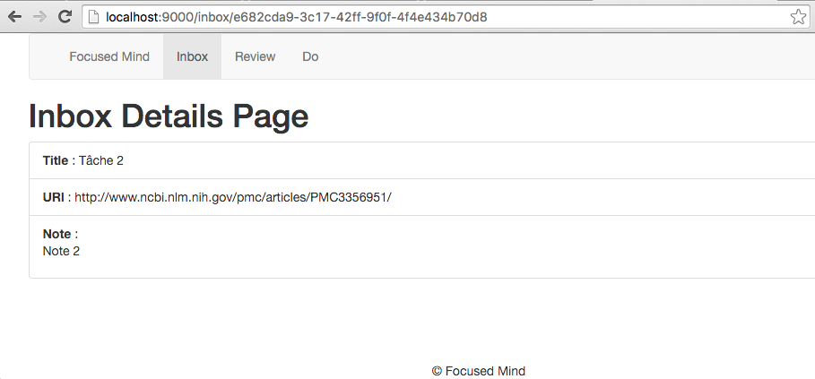

# TP #5 - Templates

## Intégration Bootstrap

* Dans le fichier `build.sbt`, ajouter la dépendance vers le projet `bootstrap`.

* Si un fichier `public/stylesheets/main.css` existe, supplimer le.

* Créer un fichier `app/assets/stylesheets/main.scss`. Y inclure le contenu suivant :

```css
@import "lib/bootstrap/scss/bootstrap.scss";
```

* Modifier l'application pour que une requête `GET /` affiche la page suivante :



    Utiliser le composant Jumbotron : http://getbootstrap.com.

## Structure de page

* Créer la structure de fichiers suivantes :

```
/app
    /views
        index.scala.html --> n'a de lien qu'avec layout/main.scala
        /layout
            footer.scala.html
            header.scala.html
            main.scala.html --> structure principale de toutes les pages
```


* Compléter les fichier pour avoir le rendu suivant :


## Navigation

* _GET /inbox_ emmène à la page suivante :


* _GET /review_ emmène à la page suivante :


* _GET /do_ emmène à la page suivante :


Arborescence des fichiers créés :

```
/app
    /controllers
        HomeController.java
        InboxController.java
        ReviewController.java
        TodoController.java
    /views
        inbox.scala.html
        index.scala.html
        review.scala.html
        todo.scala.html
        /layout
            footer.scala.html
            header.scala.html
            main.scala.html
```

## Page Inbox

* Compléter la classe `InboxItemServiceHashMap` pour qu'elle crée un jeux de données par défaut.
Par exemple :

```java

public class InboxItemServiceHashMap implements InboxItemService {

    private Map<UUID, InboxItem> items = new HashMap<>();

    public InboxItemServiceHashMap() {
        InboxItem item1 = new InboxItem("Tâche 1", "https://getbootstrap.com", "Une note sur Bootstrap");
        item1.setId(UUID.randomUUID());
        items.put(item1.getId(), item1);

        InboxItem item2 = new InboxItem("Tâche 2", "https://www.webjars.org", "Une note sur les Webjars");
        item2.setId(UUID.randomUUID());
        items.put(item2.getId(), item2);

        InboxItem item3 = new InboxItem("Tâche 3", "http://search.maven.org/", "Une note sur Maven Central");
        item3.setId(UUID.randomUUID());
        items.put(item3.getId(), item3);
    }
    
    // ...
    
}
```

* Implémenter la page _Inbox_ pour qu'elle affiche les éléments suivants :


* Un clic sur le bouton _Details_ affiche la page _/inbox/[ID_ITEM]_.

## Page Inbox Details

* Implémenter la page _Inbox Details_ pour avoir le rendu suivant :



* Si l'identifiant UUID n'est pas trouvé, alors la page suivante s'affiche :


Effectuer le test avec un UUID valide (par exemple : http://localhost:9000/inbox/608c811b-01f6-4690-93bc-74285b7e1b2b).

 