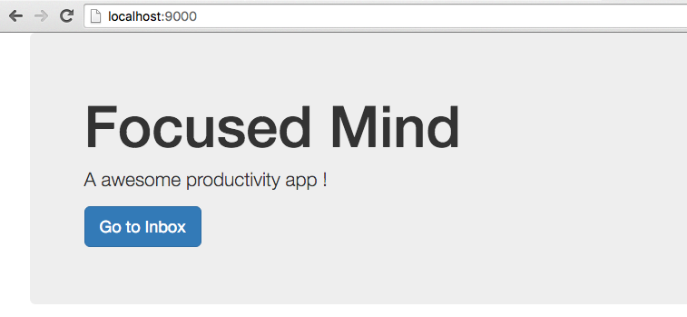
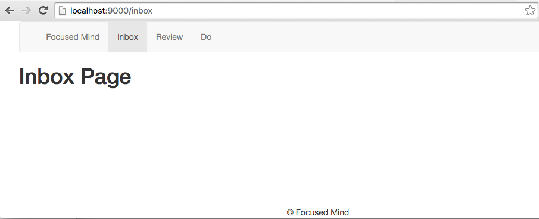
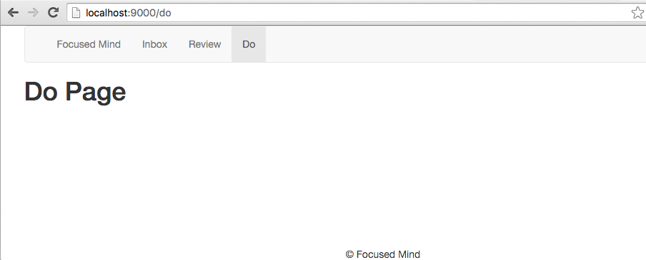
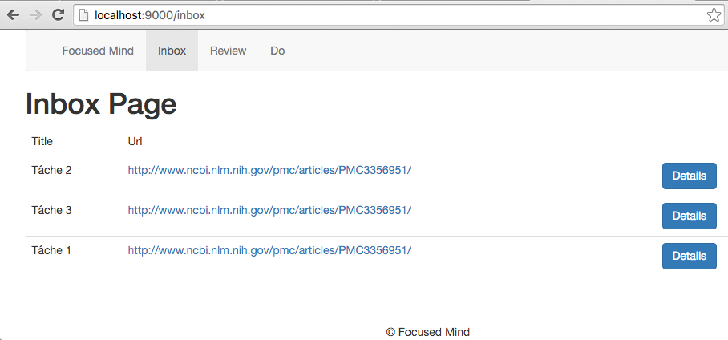
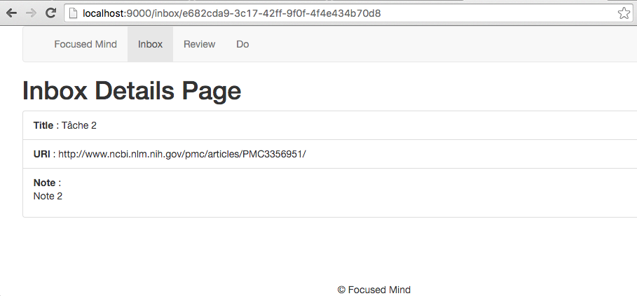
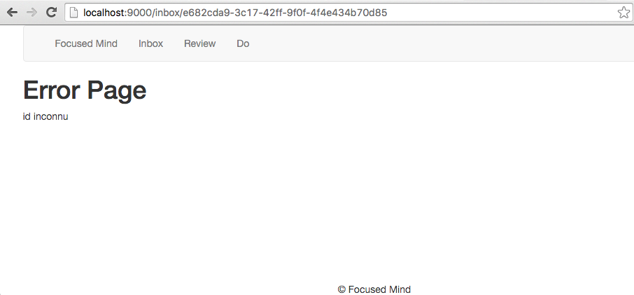

# TP #4 - Templates

## Intégration Bootstrap Sass

* Dans le fichier `build.sbt`, ajouter la dépendance vers le projet `bootstrap-sass`.

* Créer un fichier `app/assets/stylesheets/main.scss`. Y inclure le contenu suivant :

```css
@import "lib/bootstrap-sass/assets/stylesheets/_bootstrap.scss";

footer {
  position: fixed;
  text-align: center;
  bottom: 0;
  width: 100%;
}
```

* Modifier l'application pour que une requête `GET /` affiche la page suivante :



Utiliser le composant Jumbotron : http://getbootstrap.com/components/#jumbotron.

## Structure de page

* Créer la structure de fichiers suivantes :

```
/app
    /views
        index.scala.html --> n'a de lien qu'avec layout/main.scala
        /layout
            footer.scala.html
            header.scala.html
            main.scala.html --> structure principale de toutes les pages
```


* Compléter les fichier pour avoir le rendu suivant :


## Navigation

* _GET /inbox_ emmène à la page suivante :



* _GET /review_ emmène à la page suivante :


* _GET /do_ emmène à la page suivante :



Arborescence des fichiers créés :

```
/app
    /controllers
        HomeController.java
        InboxController.java
        ReviewController.java
        TodoController.java
    /views
        inbox.scala.html
        index.scala.html
        review.scala.html
        todo.scala.html
        /layout
            footer.scala.html
            header.scala.html
            main.scala.html
```

## Page Inbox

* Implémenter la page _Inbox_ pour qu'elle affiche les éléments suivants :



* Un clic sur le bouton _Details_ affiche la page _/inbox/[ID_ITEM]_.

## Page Inbox Details

* Implémenter la page _Inbox Details_ pour avoir le rendu suivant :



* Si l'identifiant n'est pas trouvé, alors la page suivante s'affiche :


