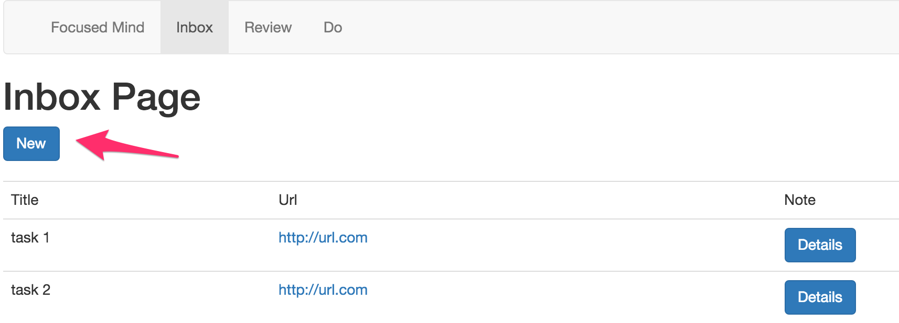
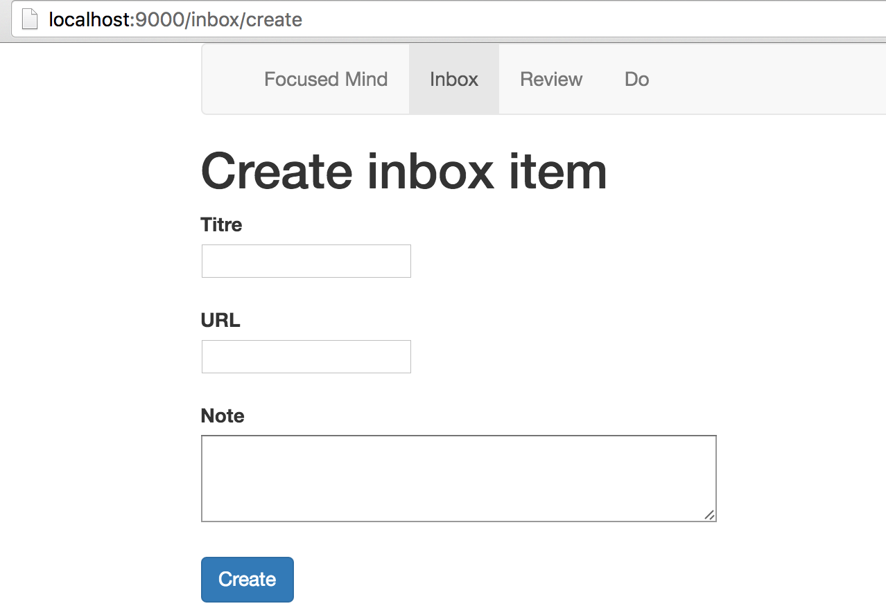
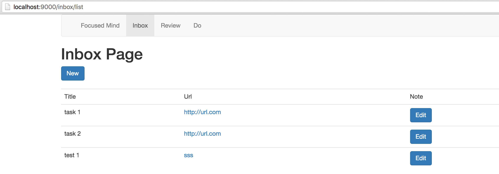
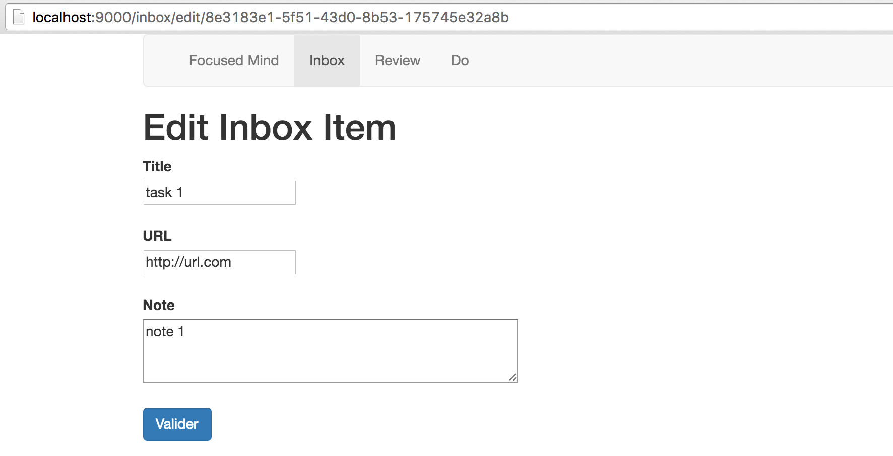

# TP #5 - Formulaires

## Créer une nouvelle tâche

* Ajouter un bouton `New` dans la page `Inbox`.



* Implémenter le formulaire de création de nouvelle tâche.



2 routes sont à créer :

```
GET     /inbox/create
POST    /inbox/create 
```

* Ajouter des contraintes de validation sur le titre d'une tâche (champ `title`) : champs requis et de taille minimum égale à 3.

* Lors de la soumission du formulaire, en cas d'erreur de validation, la page courante s'affiche à nouveau.

* Lors de la soumission du formulaire, en cas de succès, l'utilisateur est redirigé vers la liste des tâches (`Inbox`).

## Editer une tâche

* Renommer les boutons `Details` en `Edit`.



* Implémenter le formulaire d'édition pour permettre la mise à jour d'une tâche.



2 routes seront à créer :

```
GET     /inbox/edit/:id
POST    /inbox/edit/:id 
```

* Lors de la soumission du formulaire, en cas d'erreur de validation, la page courante s'affiche à nouveau.

* Lors de la soumission du formulaire, en cas de succès, l'utilisateur est redirigé vers la liste des tâches (`Inbox`).