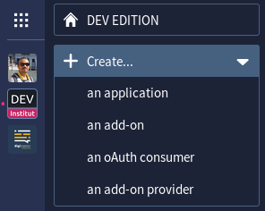
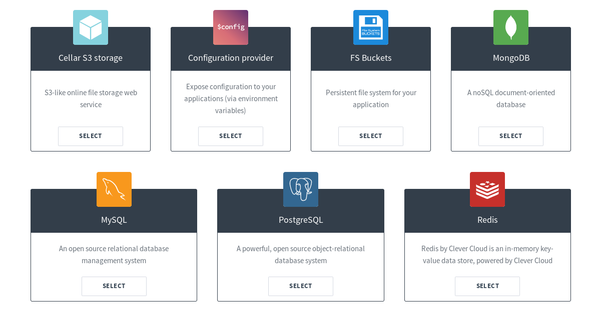
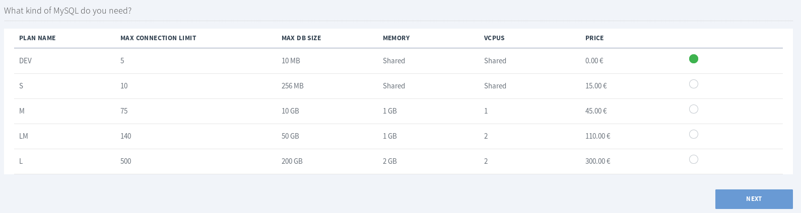
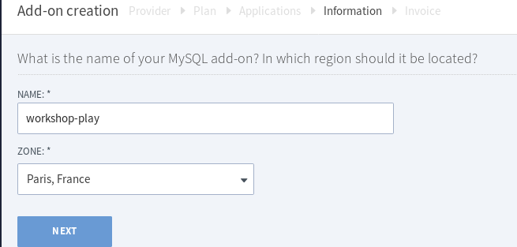
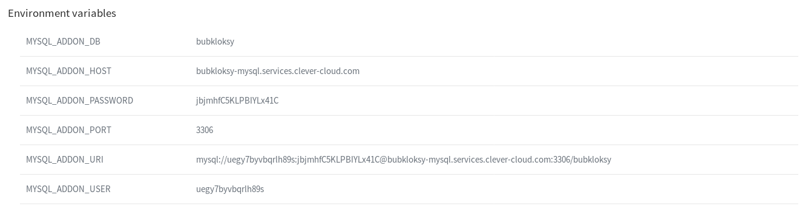
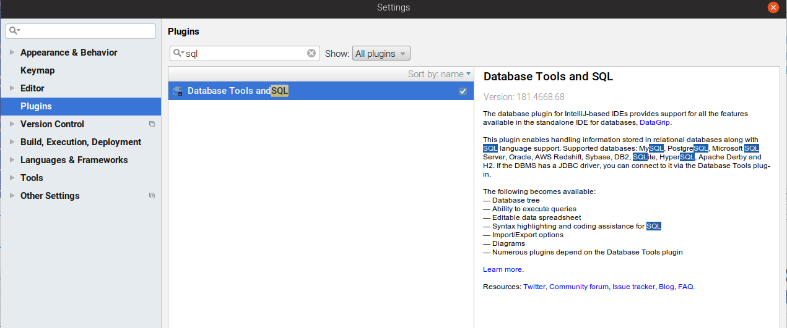
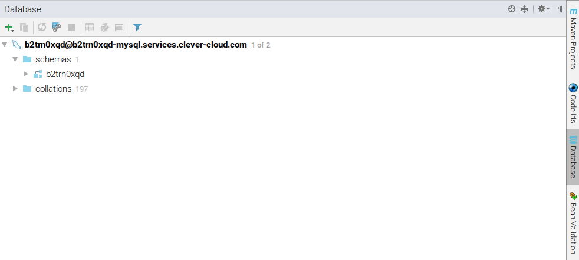

# TP #8 - Persistance JPA

## Base de données

Pour ce TP, il nous faut une base données.

Si vous avez une base de données SQL installée sur votre machine, vous pouvez l'utiliser.

Dans le cas contraire, je vous propose d'en créer une gratuitement en ligne grâce à l'hébergeur : **Clever Cloud**.

Pour cela :

* Créer un compte chez [Clever Cloud](https://api.clever-cloud.com/v2/sessions/signup).

* Choisir le menu `Create... > an add-on`



* Sélectionner MySQL.



* Choisir le plan gratuit.



* Ne lier l'add-on à aucune application.

* Choisir un nom (par exemple `workshop-play`).



* Vous trouverez les informations de connexion à la base de données dans la rubrique `workshop-play > Information`.



## IntelliJ

* Ajouter le plugin `Database Tools and SQL`.
    


* Se rendre dans l'onglet `Database` et créer une connexion à la base de données.



* Créer une table `INBOX_ITEM`.

```sql
create table INBOX_ITEM
(
	ID varchar(255) not null primary key,
	URL varchar(100) null,
	NOTE varchar(255) null,
	TITLE varchar(50) null
);
```
 
## Configuration JPA

### Librairies

* Ajouter dans le fichier `build.sbt` les librairies suivantes :

```scala
libraryDependencies ++= Seq(
  javaJpa,
  "org.hibernate" % "hibernate-core" % "5.3.1.Final",
  "mysql" % "mysql-connector-java" % "5.1.41"
)
```

`hibernate-core` est une implémentation de JPA.

`mysql-connector-java` est un driver permettant de se connecter à une base MySQL.
Si vous utiliser un autre de type de base, il faudra remplacer cette dépendance par le driver qui correspond à votre base.

## Fichier de configuration `META-INF/persistence.xml`

* Créer le fichier `conf/META-INF/persistence.xml` avec le contenu suivant :

```xml
<persistence xmlns:xsi="http://www.w3.org/2001/XMLSchema-instance"
             xmlns="http://xmlns.jcp.org/xml/ns/persistence"
             xsi:schemaLocation="http://xmlns.jcp.org/xml/ns/persistence http://xmlns.jcp.org/xml/ns/persistence/persistence_2_1.xsd"
             version="2.1">

    <persistence-unit name="focused-mind-pu" transaction-type="RESOURCE_LOCAL">
        <provider>org.hibernate.jpa.HibernatePersistenceProvider</provider>
        <non-jta-data-source>CleverCloudDS</non-jta-data-source>
    </persistence-unit>

</persistence>

```

## Information de connexion à la base

* Ajouter la configuration suivante au fichier `conf/application.conf`.

```properties
db.default.driver = com.mysql.jdbc.Driver
db.default.url = "jdbc:mysql://HOST:3306/DATABASE"
db.default.username = USER
db.default.password = PASSWORD

db.default.jndiName = CleverCloudDS

jpa.default = focused-mind-pu
```

* Remplacer `HOST`, `DATABASE`, `USER` et `PASSWORD` par des valeurs adéquates.

## Mapping JPA

* Ajouter le mapping JPA sur l'entité `models.InboxItem`.

Exemple de mapping :

```java
@Entity
@Table(name = "INBOX_ITEM")
public class InboxItem {


    @Id
    @Column(name = "ID")
    // configuration d'un générateur UUID Hibernate
    @GeneratedValue(generator = "uuid2")
    @GenericGenerator(name = "uuid2", strategy = "uuid2")
    @Type(type = "uuid-char") // stocker l'UUID au format chaîne de caractères au lieu d'un format binaire.
    private UUID id;


    @Constraints.Required
    @Constraints.MinLength(3)
    @Column(name = "TITLE")
    private String title;
    @Column(name = "URL")
    private String url;
    @Column(name = "NOTE")
    private String note;
    
    //...
    
}
```

## Contexte d'exécution

* Créer une classe `contexts.DatabaseExecutionContext` avec le contenu suivant :


```java
package contexts;

import akka.actor.ActorSystem;
import scala.concurrent.ExecutionContext;
import scala.concurrent.ExecutionContextExecutor;

import javax.inject.Inject;

public class DatabaseExecutionContext implements ExecutionContextExecutor {
    
    // nom du contexte d'exécution
    // ce nom sera utilisé dans le fichier `conf/application.conf`
    private static final String NAME = "database.dispatcher";
    
    // instance du contexte d'exécution
    private final ExecutionContext executionContext;

    @Inject
    public DatabaseExecutionContext(ActorSystem actorSystem) {
        this.executionContext = actorSystem.dispatchers().lookup(NAME);
    }

    @Override
    public ExecutionContext prepare() {
        return executionContext.prepare();
    }

    @Override
    public void execute(Runnable command) {
        executionContext.execute(command);
    }

    @Override
    public void reportFailure(Throwable cause) {
        executionContext.reportFailure(cause);
    }
}
```

* Ajouter la configuration suivante au fichier `conf/application.conf`.

```

db.default.hikaricp.maximumPoolSize = 2

database.dispatcher {
  executor = "thread-pool-executor"
  throughput = 1
  thread-pool-executor {
    fixed-pool-size = 2 // garder la correspondance avec la taille du pool de connexion
  }
}

```

## Implémentation Jpa

* Créer une classe `services.inbox.InboxItemServiceJpa` qui sera une implémentation Jpa de l'interface `services.inbox.InboxItemService`.

```java

@Singleton
public class InboxItemServiceJpa implements InboxItemService {

    private JPAApi jpaApi;
    private DatabaseExecutionContext exec;

    @Inject
    public InboxItemServiceJpa(JPAApi jpaApi, DatabaseExecutionContext executionContext) {
        this.jpaApi = jpaApi;
        this.exec = executionContext;
    }
    
    @Override
    public CompletionStage<List<InboxItem>> findAll() {

        return CompletableFuture.supplyAsync(() -> jpaApi.withTransaction(em -> {
            TypedQuery<InboxItem> query = em.createQuery("select i from InboxItem i", InboxItem.class);
            return query.getResultList();
        }), exec);
    }
    
    // TODO les méthodes ci-dessous seront à implémenter.
    
    @Override
    public CompletionStage<Optional<InboxItem>> findOne(UUID id) {
        return CompletableFuture.supplyAsync(() -> null, exec);
    }


    @Override
    public CompletionStage<InboxItem> save(String title, String url, String note) {

        return CompletableFuture.supplyAsync(() -> null, exec);
    }

    @Override
    public CompletionStage<InboxItem> update(UUID id, String title, String url, String note) {

        return CompletableFuture.supplyAsync(() -> null, exec);
    }

    @Override
    public CompletionStage<Optional<InboxItem>> delete(UUID id) {
        return CompletableFuture.supplyAsync(() -> null, exec);
    }
    
}
```

* Paramétrer Guice, pour que l'implémentation Jpa soit celle utilisée par l'application.

* Insérer quelques données dans la table `INBOX_ITEM`.

* Vérifier que la page liste des InboxItem fonctionne.

* Compléter l'implémentation Jpa.

