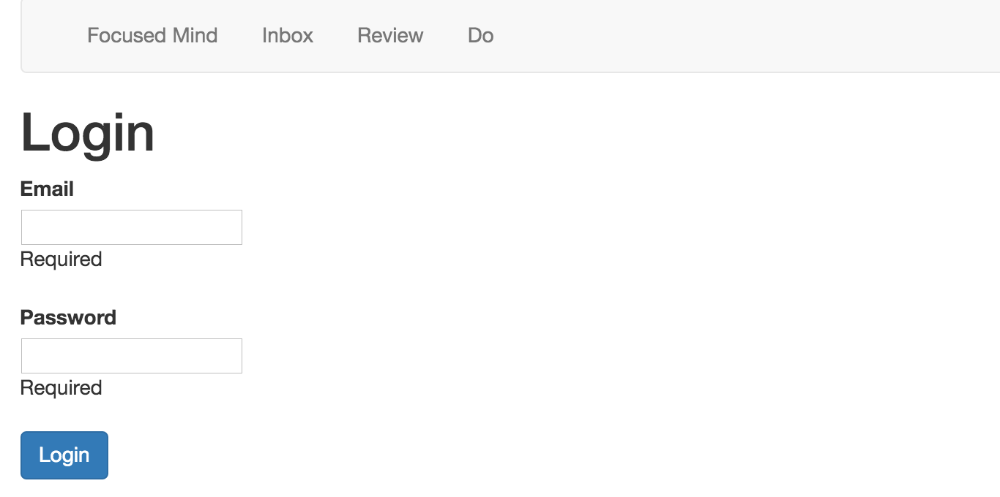

# TP #9 - Sécurité

## Authentification

* Créer une table `USER`  :

```sql
CREATE TABLE USER (
	ID varchar(255) not null primary key,
    EMAIL varchar(255) NOT NULL,
   	PASSWORD varchar(255) NOT NULL
);
```

* Insérer un utilisateur en base de données.

* Créer la classe modèle _models.User_ correspondante à la table _user_.

* Créer un service `services.UserService` :


```java

public class UserService {

    private JPAApi jpaApi;
    private DatabaseExecutionContext exec;

    @Inject
    public UserService(JPAApi jpaApi, DatabaseExecutionContext exec) {
        this.jpaApi = jpaApi;
        this.exec = exec;
    }

    public CompletionStage<Optional<User>> authenticate(String email, String password) {
        return CompletableFuture.supplyAsync(() -> this.jpaApi.withTransaction(em -> {
            // TODO

        }));
    }
}
```

* Créer une page d'authentification.



* Créer une classe `security.Secured` :

```java

public class Secured extends Security.Authenticator {

    @Override
    public String getUsername(Context ctx) {
        return ctx.session().get("email");
    }

    @Override
    public Result onUnauthorized(Context ctx) {
        return redirect(routes.LoginController.index());
    }

}
```

* Sécuriser des actions et tester le résultat en utilisant l'annotation `@Security.Authenticated(Secured.class)` sur un contrôleur ou une action.

