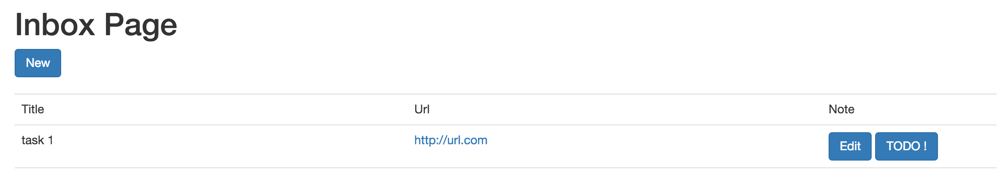

# TP #10 - Akka

## Générateur d'_Inbox Item_

* Créer un acteur _actors.GenerateInboxItemActor_ qui permet de créer un instance de type _models.InboxItem_ avec des données générées.

```java
package actors;

import akka.actor.AbstractActor;
import akka.actor.ActorRef;
import akka.actor.Props;
import models.InboxItem;
import play.Logger;

import javax.inject.Inject;
import javax.inject.Named;
import java.util.UUID;

public class GenerateInboxItemActor extends AbstractActor {

    public static final String NAME = "gen-inbox-item-actor";

    @Override
    public Receive createReceive() {

        return receiveBuilder().
                match(Boolean.class, (msg) -> {

                    String uuid = UUID.randomUUID().toString();
                    
                    InboxItem item = null;
                    
                    // TODO créer un object InboxItem
                    // title = Task + UUID
                    // url = http://UUID.fr
                    // note = NOTE + UUID

                    Logger.info("{} : {}", NAME, item);

                }).build();
    }
}
```

* Créer une classe `StartupTask` :

```java
public class StartupTask {

    private final ActorRef genInboxItemActor;
    private final ActorSystem actorSystem;
    private final ExecutionContext executionContext;

    @Inject
    public StartupTask(@Named(GenerateInboxItemActor.NAME) ActorRef genInboxItemActor, ActorSystem actorSystem, ExecutionContext executionContext) {
        this.genInboxItemActor = genInboxItemActor;
        this.actorSystem = actorSystem;
        this.executionContext = executionContext;
        this.onStartup();
    }

    private void onStartup() {

        // Démarrage du générateur d'InboxItem
        actorSystem.scheduler().schedule(
                Duration.create(0, TimeUnit.SECONDS), // initialDelay
                Duration.create(5, TimeUnit.SECONDS), // interval
                genInboxItemActor,
                true, // message,
                executionContext,
                ActorRef.noSender()
        );

    }
}
```

* Mettre à jour le module Guice :

```java

public class Module extends AbstractModule implements AkkaGuiceSupport {


    @Override
    protected void configure() {

        // Choix de l'implémentation de l'interface InboxItemService
        bind(InboxItemService.class).to(InboxItemServiceJpa.class);
        
        bindActor(GenerateInboxItemActor.class, GenerateInboxItemActor.NAME);
      
        bind(StartupTask.class).asEagerSingleton();

    }
}

```

* Lancer l'application et vérifier le résultat dans la console.

* Compléter l'acteur pour qu'il crée bien un objet InboxItem.


## Acteur de sauvegarde d'_Inbox Item_

* Créer un acteur _actors.SaveInboxItemActor_ qui reçoit des messages de type _models.InboxItem_.

* Cet acteur insère les données dans la base de données via le service _InboxItemService_.

* Modifier l'acteur _actors.GenerateInboxItemActor_ pour qu'il envoie un message à _actors.SaveInboxItemActor_ à l'issue de la génération de l'instance de type _models.InboxItem_.

* Vérifier que la liste des _Inbox Items_ s'alimente.


## Acteur de création d'action _TODO_

* Ajouter une table _todo_item_:

```sql
CREATE TABLE TODO_ITEM (
    ID varchar(255) NOT NULL,
    TITLE varchar(255) NOT NULL,
    DONE boolean,
    DESCRIPTION varchar(255),
    PRIMARY KEY (id)
);
```

* Créer le modèle _models.TodoItem_ correspondant à la table ci-dessus.

* Créer un acteur _actors.CreateTodoItemActor_ qui reçoit en entrée un identifiant d'_Inbox Item_.

* A partir de cet identifiant, l'acteur génère une instance de _models.TodoItem_ à partir des informations d'_Inbox Item_.

```
TodoItem.title = "Do : " + InboxItem.title
TodoItem.description = "Do : " + InboxItem.url + " " + InboxItem.note
TodoItem.done = false
```

* L'instance _models.TodoItem_ est sauvegarder en base de données.

* La donnée _Inbox Item_ est supprimée.

## Bouton _TODO !_

* Ajouter un bouton _TODO !_ dans la page de la liste des _Inbox Item_.



* Ce bouton permet de transformer un _Item Box_ en _Todo Item_ via l'acteur _actors.CreateTodoItemActor_. Le résultat de l'action dépend de la fin du traitement de l'acteur. L'utilisateur est redirigé vers la page de liste de _TODO_.

* Implémenter la page de liste de _Todo Item_.

* Vérifier le résultat.

