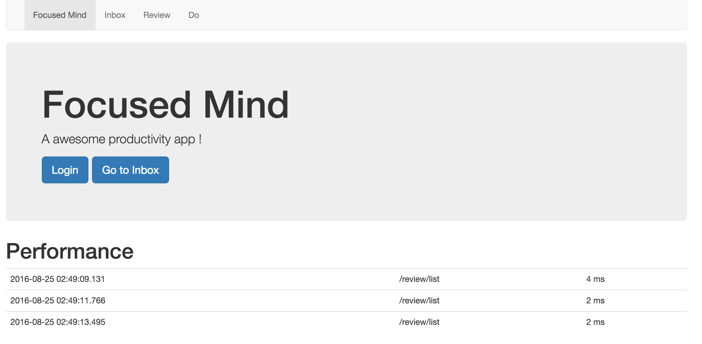
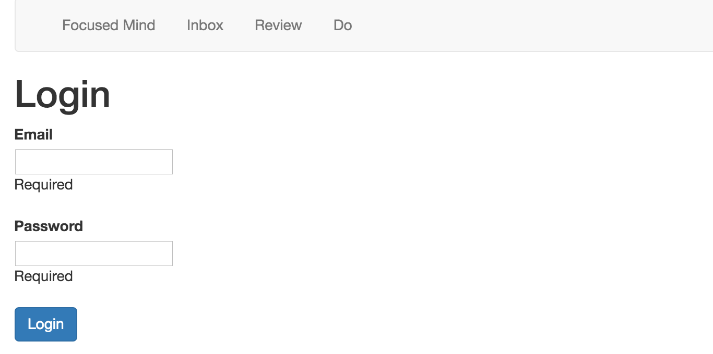

# TP #7 - Sécurité

## Composer des actions

L'objectif de cette section de monitorer le temps d'exécution des actions.

* Compléter le fichier _conf/evolutions/default/1.sql_ avec le contenu suivant :

```sql
CREATE TABLE performance (
    id UUID NOT NULL,
    path varchar(255) NOT NULL,
    when_created timestamp,
    duration BIGINT
);
```

* Créer la classe modèle `models.Performance` correspondante à la table _performance_.

* Créer une annotation `@MonitorRequest` qui, placée au dessus d'une action_ alimente la table _performance_ avec les informations d'exécution de la requête.

* Modifier la page d'accueil pour afficher le contenu de la table `performance`.



### Authentification

* Compléter le fichier _conf/evolutions/default/1.sql_ avec le contenu suivant :

```sql
CREATE TABLE user(
	id UUID NOT NULL,
    email varchar(255) NOT NULL,
   	password varchar(255) NOT NULL
);

INSERT INTO user(id,email,password) values(uuid(),'dev@admin.fr', 'dev');
```

* Créer la classe modèle _models.User_ correspondante à la table _user_.

* Créer une page d'authentification.



* Créer une annotation qui permet de sécuriser des actions.

* Sécuriser des actions et tester le résultat.