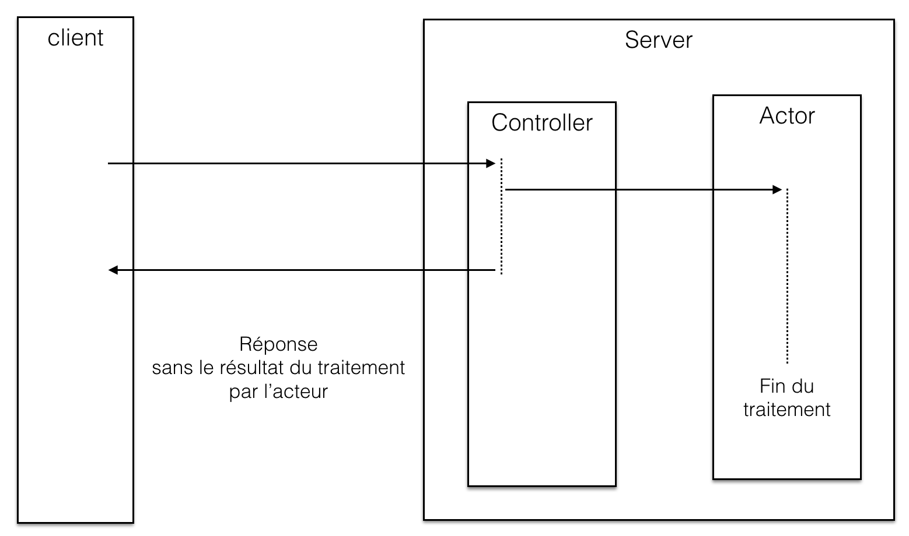
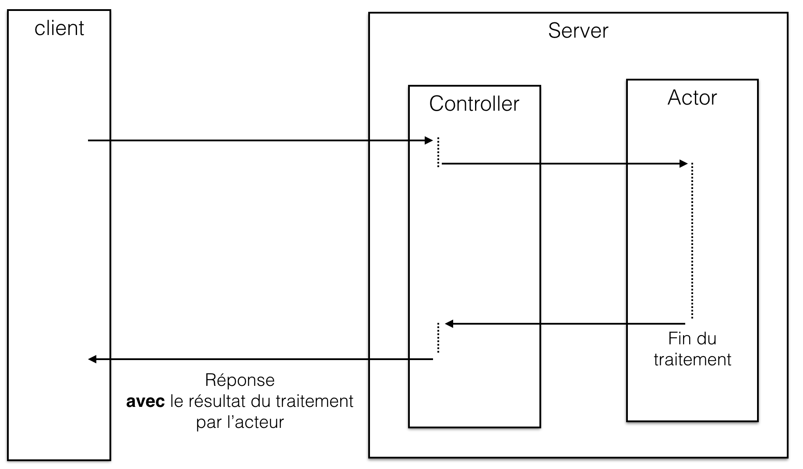

# Cas d'utilisation

Dans une application Play!, il y a 3 cas d'utilisation récurrents d'acteur :

* **cas 1 : envoyer un message à un acteur en mode _fire and forget_.** Le résultat du traitement n'intéresse pas immédiatement l'auteur de la requête HTTP.

* **cas 2 : envoyer un message à un acteur et retourner le résultat** quand il est disponible.

* **cas 3 : déclencher des traitements programmés** (différés et/ou fréquents).


## Cas 1 : envoyer un message à un acteur en mode `fire and forget_`. 



Utiliser la méthode `tell(message, sender)` de l'acteur.

```java
public Result action() {

    myActor.tell(message, null);
    return ok(views.html.myview.render());

}

```

## Cas 2 : envoyer un message à un acteur et retourner le résultat




```java

public CompletionStage<Result> action() {

// paramètre 1 = acteur
// paramètre 2 = message
// paramètre 3 = timeout
Future<Object> actorResponse = Patterns.ask(myActor, monMessage, 10000);

// Transformation Future (Scala) -> CompletionStage (Java 8)
// Construction du résultat avec la réponse de l'acteur
// Cela suppose que l'acteur envoie bien un retour (sender().tell(..))
return FutureConverters.toJava(actorResponse)
        .thenApply(response -> ok(Json.toJson(response)));
}
```


## Cas 3 : déclencher des traitements programmés

```java
public class MyController extends Controller {

    @Inject 
    public MyController(ActorSystem system) {
         ActorRef myActor = system.actorOf(MyActor.props);

        system.scheduler().schedule(
            Duration.create(0, TimeUnit.MILLISECONDS), // Délai initial
            Duration.create(1, TimeUnit.SECONDS),     // Fréquence
            myActor,
            "hello", // message
            system.dispatcher(), // context d'exécution
            null // émetteur
        );
    }
}
```

