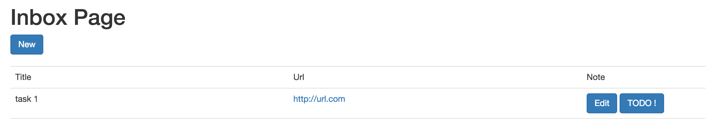

# TP #8 - Asynchronisme

## Générateur d'_Inbox Item_

* Créer un acteur _actors.GenerateInboxItemActor_ qui permet de créer un instance de type _models.InboxItem_ avec des données générées.

* Cet acteur log dans la console les informations de l'instance créée.

* Dans le contrôleur _InboxController_, démarrer un traitement programmé qui consiste à envoyer un message vide à l'acteur _actors.GenerateInboxItemActor_ toutes les secondes.

* Vérifier le résultat dans la console.

## Acteur de sauvegarde d'_Inbox Item_

* Créer un acteur _actors.SaveInboxItemActor_ qui reçoit des messages de type _models.InboxItem_.

* Cet acteur insère les données dans la base de données via le service _InboxItemService_.

* Modifier l'acteur _actors.GenerateInboxItemActor_ pour qu'il envoie un message à _actors.SaveInboxItemActor_ à l'issue de la génération de l'instance de type _models.InboxItem_.

* Vérifier que la liste des _Inbox Items_ s'alimente.


## Acteur de création d'action _TODO_

* Ajouter une table _todo_item_ dans le script _Evolutions_ :

```sql
CREATE TABLE todo_item (
    id UUID NOT NULL,
    title varchar(255) NOT NULL,
    done boolean,
    description varchar(255),
    PRIMARY KEY (id)
);
```

* Créer le modèle _models.TodoItem_ correspondant à la table ci-dessus.

* Créer un acteur _actors.CreateTodoItemActor_ qui reçoit en entrée un identifiant d'_Inbox Item_.

* A partir de cet identifiant, l'acteur génère une instance de _models.TodoItem_ à partir des informations d'_Inbox Item_.

```
TodoItem.title = "Do : " + InboxItem.title
TodoItem.description = "Do : " + InboxItem.url + " " + InboxItem.note
TodoItem.done = false
```

* L'instance _models.TodoItem_ est sauvegarder en base de données.

* La donnée _Inbox Item_ est supprimée.

## Bouton _TODO !_

* Ajouter un bouton _TODO !_ dans la page de la liste des _Inbox Item_.



* Ce bouton permet de transformer un _Item Box_ en _Todo Item_ via l'acteur _actors.CreateTodoItemActor_. Le résultat de l'action dépend de la fin du traitement de l'acteur. L'utilisateur est redirigé vers la page de liste de _TODO_.

* Implémenter la page de liste de _Todo Item_.

* Vérifier le résultat.

## Acteur _actors.BuildReportActor_

* Créer un acteur _actors.BuildReportActor_ qui simule un traitement lent.

```java
Logger.info("Acteur - Génération de rapport...", e);

try {
    Thread.sleep(10000); // volontairement lent
} catch (InterruptedException e) {
    Logger.error("oops", e);
}
Logger.info("Acteur - Fin génération de rapport...", e);
```

## Bouton _Generate report_

* Dans la page de liste _Inbox Item_, ajouter un bouton _Generate report_.

* Ce bouton déclenche une requête

```
POST    /reports    controllers.ReportController.doReport
``` 

* L'action _controllers.ReportController.doReport_ post un message (vide) à l'acteur _actors.BuildReportActor_.

* L'action n'attend pas la fin du traitement de l'acteur pour produire un résultat.

## WebSocket

* Mettre en place un WebSocket qui permet de notifier tous les clients que le rapport est généré.

* Afficher un message à l'écran.


